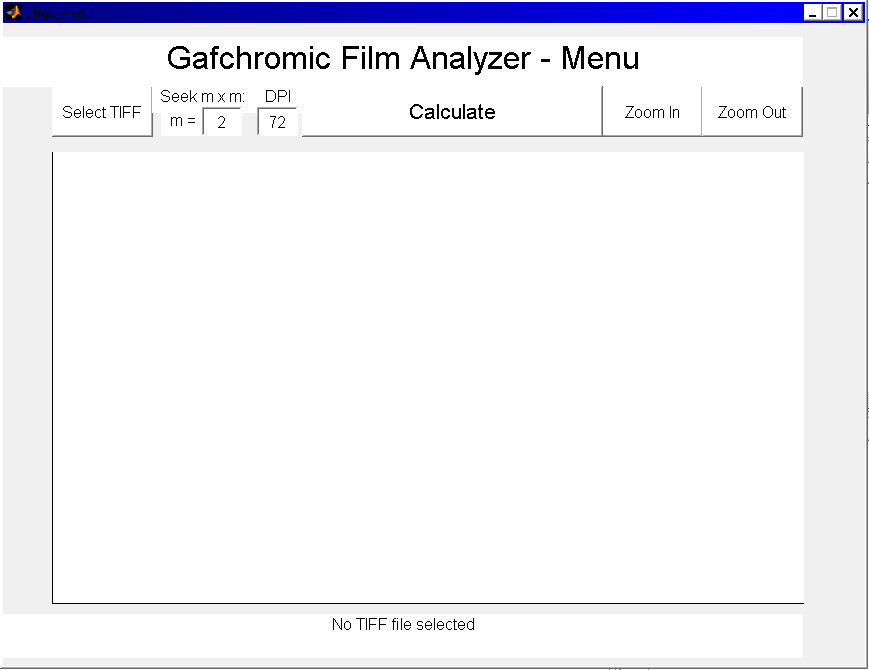

Gafchromic Film RGB Analyzer
============================

Usage
-----

Run `gfrgb_menu` in the MATLAB console to instantiate the image selection interface.  Converts image to a triplet of grayscale matrices for processing.  Currently 16-bit TIFF images are allowed.

Features
--------
- Semi-infinite zooming
- m`x`m minimization seek for `m>=0`
- Pixel-scroll manual vertex seek
- Discrete Angular plot for `r>0` with pixel tolerance average
- Radial plot at critical angle θ of source direction
- Data directory variable output by date and time

Development
-----------
Source code and issue tracking are available at GitHub:  
[https://github.com/WPIRadiationPhysics/GFRGB](https://github.com/WPIRadiationPhysics/GFRGB)

Screenshots
-----------

License
-------

    GFRGB - Gafchromic Film RGB Analyzer

    Copyright (C) 2015  Shaun Marshall

    This program is free software: you can redistribute it and/or modify
    it under the terms of the GNU General Public License as published by
    the Free Software Foundation, either version 3 of the License, or
    (at your option) any later version.

    This program is distributed in the hope that it will be useful,
    but WITHOUT ANY WARRANTY; without even the implied warranty of
    MERCHANTABILITY or FITNESS FOR A PARTICULAR PURPOSE.  See the
    GNU General Public License for more details.

    You should have received a copy of the GNU General Public License
    along with this program.  If not, see <http://www.gnu.org/licenses/>.